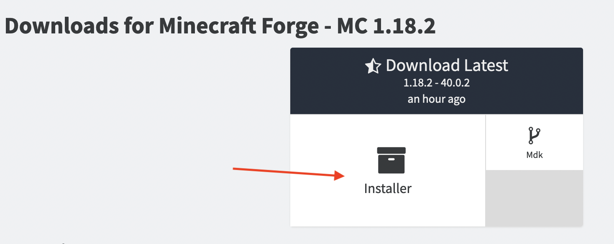
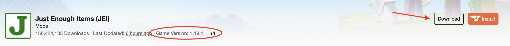
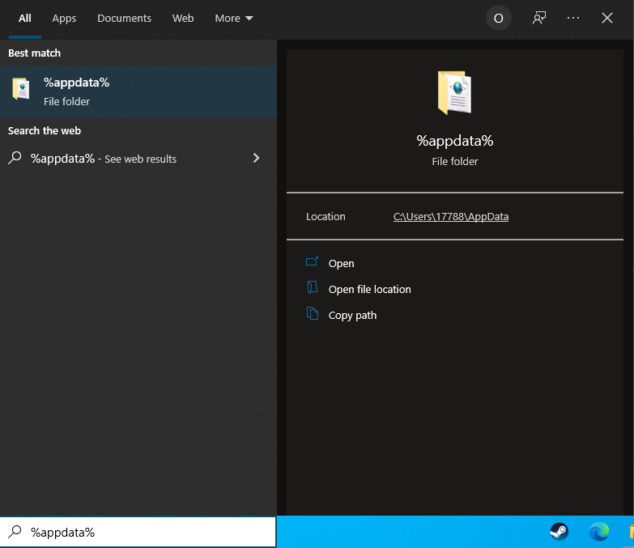
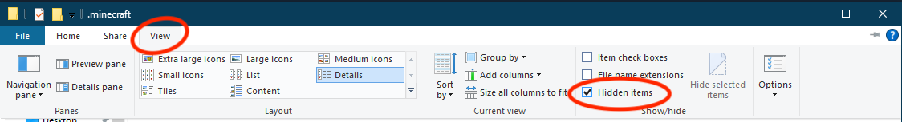
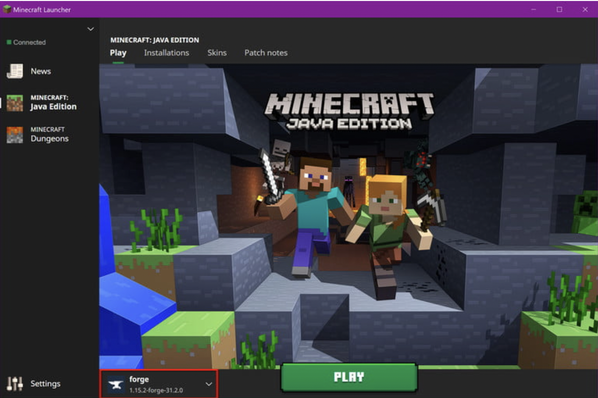

# Install Mods on a Minecraft Server

Minecraft mods are a great way to add a bunch of new content to the already existing ones. The best thing is that it's free! From pokemons to cooking content, there is most likely a mod for it somewhere.

This guide will explain the process of adding mods on your current minecraft server.

One of the most popular and easiest way to install and run mods is to use an application called Forge.

1. Go to [files.minecraftforge.net](https://files.minecraftforge.net/net/minecraftforge/forge/) and click on the installer button to download the recommened version of Forge app.

    

2. Go to [www.curseforge.com/minecraft](https://www.curseforge.com/minecraft/mc-mods) and download which mods you would like on your server. Make sure the mods you are downloading are compatible with your Forge software.
    
    

3. Create your "mods" folder in your .minecraft directory. To find .minecraft folder, go to your windows search box and enter "%appdata%". Your .minecraft folder should be near the top.

    

4. With the .minecraft folder open, right-click within File Explorer and select New followed by Folder on the pop-up menu. Name that folder “mods.”

    Note: If you can't find the AppData folder in your File Explorer, click View at the top of the window and make sure "Hidden Items" is checked.
    

5. Now, you can move the mod that you have downloaded from Curseforge into "mods" folder in your .minecraft directory. You can either copy and paste from your downloads folder or drag and drop into the mods folder.

6. Run your Minecraft game application and make sure you have selected the Forge account. This way your mods will load properly.

    

## Conclusion

Congratulations! Now you can start playing Minecraft with your newly added mods!
