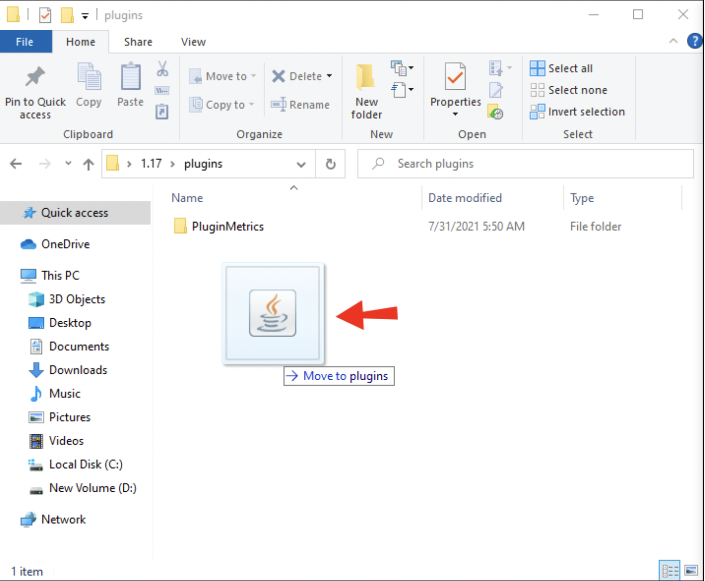

# Install Plugins on a Minecraft Server

People commonly confuse plugins with mods, but the main difference between the two is that plugins essentially are an additive file for a Minecraft multiplayer server while mods change the fundamental game, such as adding an entirely new animal or in-game item

Plugins are an extension to your Minecraft server that can add more features to your game like altered NPC behaviours and in-game economy. You can think your plugins like browser extensions you install on Google Chrome. 

Now, let's get started!

1. Go to [www.spigotmc.org/resources](https://www.spigotmc.org/resources) and download the plugins you would like on your server.

    

2. Find your .minecraft folder and go into your "plugins" folder. To find .minecraft folder, go to your windows search box and enter "%appdata%". Your .minecraft folder should be near the top.

    

3. Move your downloaded plugins into the "plugins" folder. You can do this by copy and pasting from where the plugin was downloaded or dragging and dropping into the "plugins" folder.

    

4. Start your server to confirm that your plugins have been installed correctly.

## Conclusion
{: .no_toc }

That's it! The process of installing plugins for your Minecraft server is very simple and only requires a few clicks!
