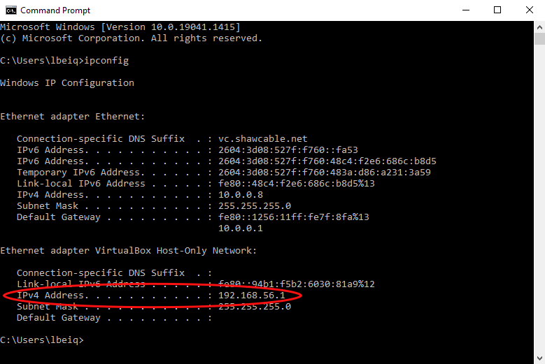

# Port Forwarding
{: .no_toc }

Now that our Minecraft server is up and running, we need to configure some settings in our network to give other players access to the server. This is a very short process, however, there can be a lot of variability in this task because every router is different. In this guide, we will cover the steps you will have to take if you are using a Shaw Blue Curve router, but we will also briefly detail the “general” set of steps should take if you have a different router.

## Finding the IP Addresses

1. First, we need to find your Internal IP Address. 

    If you are on Windows, open the Command Prompt App. Next type the command < ipconfig >, this will give you a list Ethernet adapters. Look for the IPv4 address (it begins with 192.168) and write it down.
    
      
        
    If you are on Mac, open the Terminal App. Next type the command < ifconfig >, this will give you a list of Ethernet adapters. Look for the IPv4 address (it begins with 192.168) and write it down.

2. Next, we need to find your External IP Address. Thankfully, this one is really easy. Go to the website [whatismyipaddress.com](https://whatismyipaddress.com/) and look for the IPv4 address near the top of the page. Once again, write down this information because we will need it shortly.
        
      
        
3. Now that we have our Internal and External IP Addresses and the port number from step 9 in the “Server Initialization” (by default this port number is 25565), we can proceed to go into the settings of our router and enable Port Forwarding.

    If you do not have a Shaw Blue Curve Router, there are a few general steps you can take here. In your browser, type in your Internal IP Address. This will hopefully allow you to access your router. Inside this page, look for “advanced settings” or “networking”, and then look for “Port Forwarding”. If given a choice, you’ll want to Manually Enter this information:

    Service name: Minecraft Server  
    Service type: TCP/UDP  
    Port Ranges: 25565  
    Internal IP Address: (What you wrote down in step 1)  
    External IP Address: (What you wrote down in step 2)  

4. Find the server file in the Minecraft server folder of the file type “properties source file”, and then right-click it, select Open With, and then select Notepad. The server file should open and display all of the Minecraft server properties.

      

5. Inside the server file, find the server-port and server-ip entries. Set server-port to the same value that we used for the Port Ranges in step 3. 

      

6. Next, set the value of server-ip as the same as your Internal IP Address from step 1.

      

7. We are almost done! Next, simply start the server following steps 5 and 6 from “Server Initialization”.

      In the command prompt, type the command < cd > followed by a space and then the file path to the location of the .jar file. Hit enter to run the command. In this example, the command is < cd C:\Users\lbeiq\Desktop\Minecraft Server >

      Once you are in the correct directory in the command prompt, type the command < Java -jar > followed by a space and the name of your .jar file. Hit enter to run the command. In this example, the command is < Java -jar server.jar >

8. Finally, boot up your Minecraft client and enter the External IP Address from step 2 and you should be able to connect to your server!

Congratulations! Your friends can now join you in your world. Don’t forget to install some mods for your server to heighten your experience.
