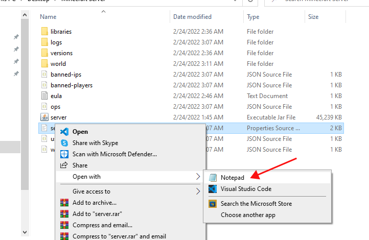

# Port Forwarding
{: .no_toc }

Now that our Minecraft server is up and running, we need to configure some settings in our network to give other players access to the server. This is a very short process, however, there can be a lot of variability in this task because every router is different. In this guide, we will cover the steps you will have to take if you are using a Shaw Blue Curve router, but we will also briefly detail the “general” set of steps you should take if you have a different router.

## Table of contents
{: .no_toc .text-delta }

1. TOC
{:toc}

## Finding the IP Addresses

1. First, we need to find your Internal IP Address. 

    If you are on Windows, open the Command Prompt App. Next type the command: `ipconfig`, this will give you a list of Ethernet adapters. Look for the `IPv4 address` (it begins with `192.168`) and write it down.
    
      
        
    If you are on Mac, open the Terminal App. Next type the command: `ifconfig`, this will give you a list of Ethernet adapters. Look for the `IPv4 address` (it begins with `192.168`) and write it down.

2. Next, we need to find your External IP Address. Thankfully, this one is really easy. Go to the website [whatismyipaddress.com](https://whatismyipaddress.com/) and look for the `IPv4 address` near the top of the page. Once again, write down this information because we will need it shortly.
        
      

## Port Forwarding   

For this part of the guide, we will give you the step by step instructions needed to forward the port on the Shaw Blue Curve Router. However, we can only give you more generalized instructions if you are currently using different router.

### Shaw Blue Curve Router

Now that we have our Internal and External IP Addresses and the port number from [Server Initialization](https://lbeique.github.io/How-To-Setup-a-Minecraft-Server/docs/Server%20Initialization/#changing-the-configurations) (by default this port number is `25565`), we can proceed to go into the settings of our router and enable Port Forwarding.

1. Connect to your Blue Curve Web App but visiting [internet.shaw.ca/connect](https://internet.shaw.ca/connect). On the main hub, click on Connect near the middle of the top of the page. Then click on your wireless network.

    

2. Under the More tab, click on Advanced Settings.

    

3. Click on Port Forwarding.

    

4. Click on Add Port Foward.

    

5. Select your DESKTOP for the device used for this port. For the configuration, choose Manual Setup or Minecraft. Set the Port Number to the one we wrote down earlier, which will be `25565` by default. Ensure that TCP/UDP is the Protocol. Hit next and that's it!

    

### Telus or Other Router

1. If you do not have a Shaw Blue Curve Router, there are a few general steps you can take here. In your browser, type in your Internal IP Address. This will hopefully allow you to access your router. Inside this page, look for “advanced settings” or “networking”, and then look for “Port Forwarding”. If given a choice, you’ll want to Manually Enter this information:

        Service name: Minecraft Server  
        Service type: TCP/UDP  
        Port Ranges: 25565  
        Internal IP Address: (What you wrote down in step 1)  
        External IP Address: (What you wrote down in step 2)

## Changing the Configurations

1. Find the server file in the Minecraft server folder of the file type `properties source file`, and then right-click it, select Open With, and then select Notepad. The server file should open and display all of the Minecraft server properties.

      

2. Inside the server file, find the `server-port` and `server-ip` entries. Set `server-port` to the same value that we used for the Port Ranges in [step 3](https://lbeique.github.io/How-To-Setup-a-Minecraft-Server/docs/PortForward/#finding-the-ip-addresses). 

      

3. Next, set the value of `server-ip` as the same as your Internal IP Address from [step 1](https://lbeique.github.io/How-To-Setup-a-Minecraft-Server/docs/PortForward/#finding-the-ip-addresses).

      

## Joining the Server

1. We are almost done! Next, simply start the server by following the steps from [Server Initialization](https://lbeique.github.io/How-To-Setup-a-Minecraft-Server/docs/Server%20Initialization/#starting-the-server).

2. Finally, boot up your Minecraft client and enter the External IP Address from [step 2](https://lbeique.github.io/How-To-Setup-a-Minecraft-Server/docs/PortForward/#finding-the-ip-addresses) and you should be able to connect to your server!

## Conclusion
{: .no_toc }

Congratulations! Your friends can now join you in your world. Don’t forget to [install some mods](https://lbeique.github.io/How-To-Setup-a-Minecraft-Server/docs/Install%20Mods/) for your server to heighten your experience.
