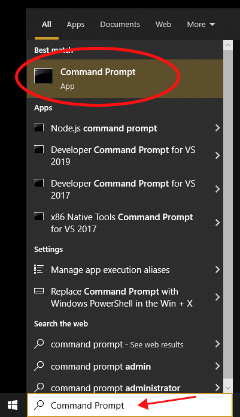
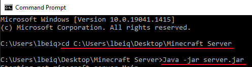
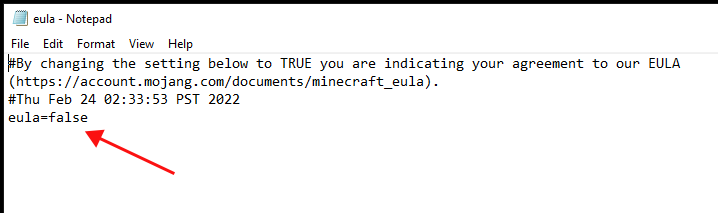
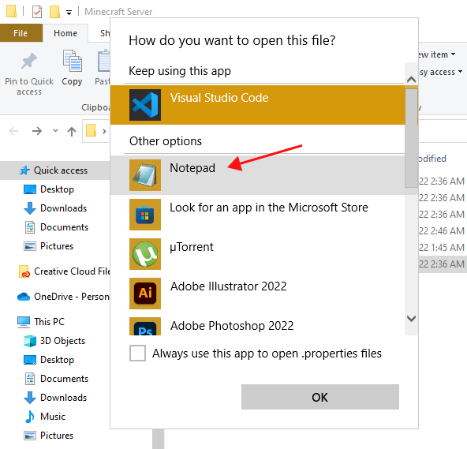
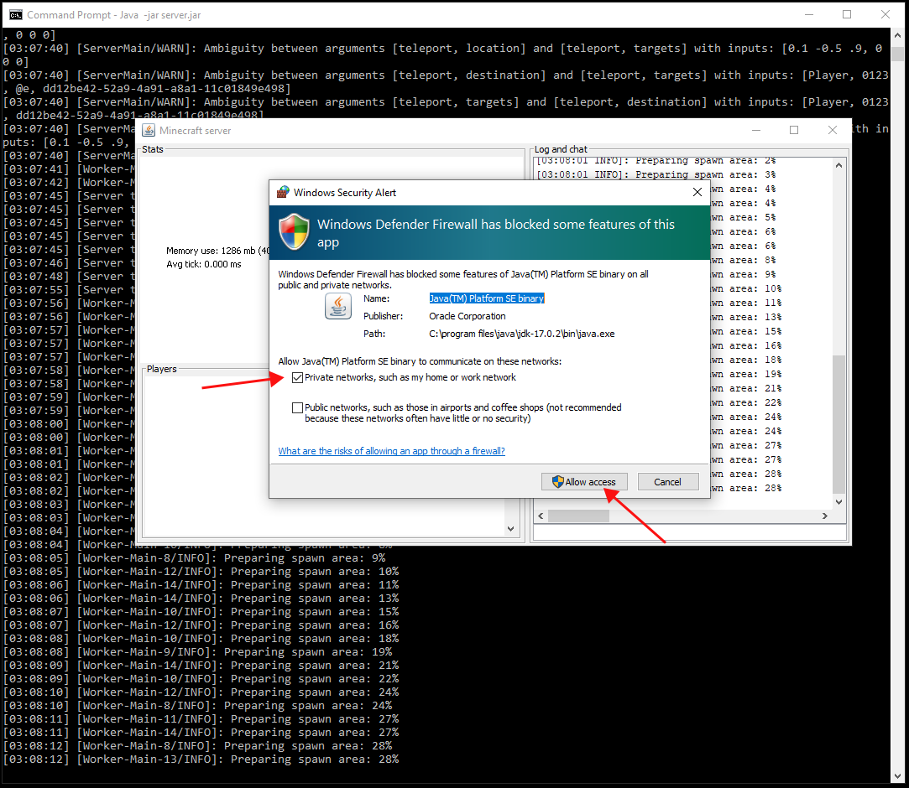

# Server Initialization

These are the steps you will take to start running your Minecraft server.

The first task to set up and host a Minecraft: Java Edition Server is to download the Minecraft Server .jar (Java ARchive) file and change its configuration settings. This task will require the use of the Command Prompt app. Do not worry, we will guide you through every step of the process.

1. Before we download the .jar file, we need to create a folder to keep all of the server files in. Create the folder on your desktop and name it “Minecraft Server”.

2. Go to [www.minecraft.net/en-us/download/server](https://www.minecraft.net/en-us/download/server) and download the minecraft_server.1.XX.X.jar file and save the file in the “Minecraft Server” folder we created.

    

3. To proceed with the next steps. we need to open up the Command Prompt application. On your desktop, go to the bottom left search bar and type in “Command Prompt”.

    

4. In order to run the commands in the Command Prompt, we need to know the location, or filepath, of the .jar file we downloaded. We can determine the file path by opening the folder and clicking on the address bar near the top.  In this example, the file path is C:\Users\lbeiq\Desktop\Minecraft Server

    

5. In the command prompt, type the command < cd > followed by a space and then the file path to the location of the .jar file. Hit enter to run the command. In this example, the command is < cd C:\Users\lbeiq\Desktop\Minecraft Server >

6. Once you are in the correct directory in the command prompt, type the command < Java -jar > followed by a space and the name of your .jar file. Hit enter to run the command.  In this example, the command is < Java -jar server.jar >

    

7. In the Minecraft Server folder, open the eula.txt file by double-clicking it. Inside the file, change the line < eula=false > and write and replace it with the line < eula=true >. You might notice a star in the file header in the top left. This indicates that there are unsaved changes. Make sure to save your changes and then close the file.

    

    

    

8. Find the server file of the file type “properties source file”, and then right-click it, select Open with, and then Choose another app. Next, click on more apps, and scroll down until you find Notepad. Select Notepad and the file should open up with all of the Minecraft server properties.

    

    

    

    

9. Look for the < query.port > line and write down the port number. This will be important when we forward the ports in Task 2, to allow other users to join the server. In this server properties file, there are many settings that you can change and we will explain them more extensively in another section.

    

10. Now that we have the port number recorded, we return to the command prompt app. To run the server, simply repeat steps 5 and 6.  If you get a Windows Security Alert, simply Allow access to Private networks, such as my home or work network.

    

11. And thats it! Your server should now be running! If you want to close your server, simply close the Minecraft server app and the server will turn off.

    

Great job! Next we will forward the server port so that we can invite other users to the Minecraft Server!
