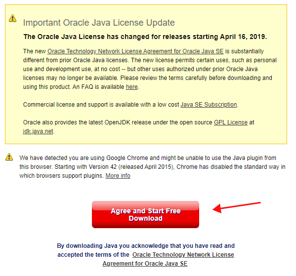
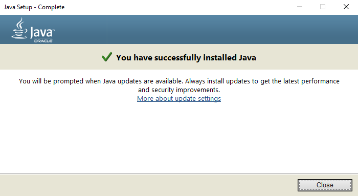
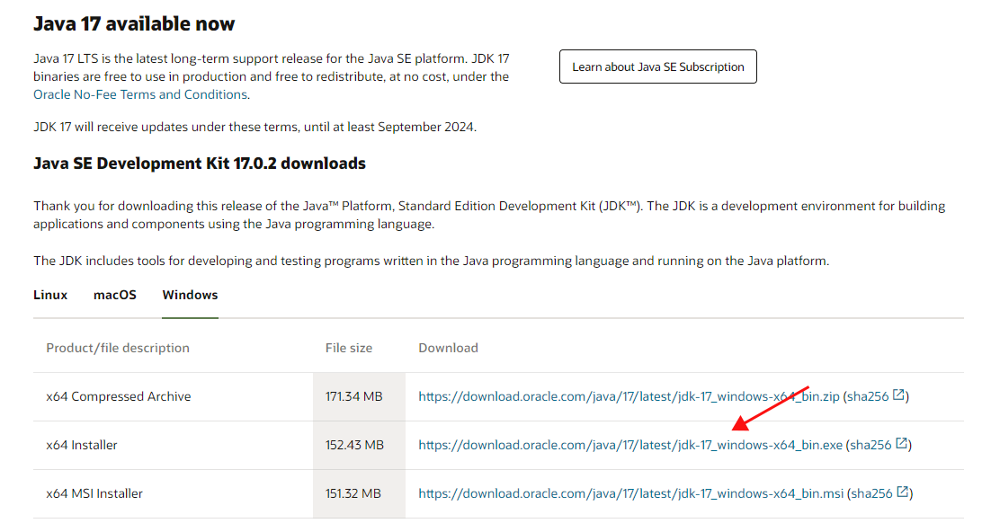

# Introduction

On a public server players can collaborate with other plays to build more and play mini games. However, you cannot control exactly who can connect to the public servers. By setting up your own local server you can control exactly who can connect.

Setting up your own local server requires changing your home network's configuration and is not recommended unless you know what you are doing. If this is a concern for you, please see our alternative guide to set up a private server by purchasing Minecraft Realms. If you still want to go with this free route, please do so at your own risk!

---

## Table of contents
{: .no_toc .text-delta }

1. TOC
{:toc}

## Intended Users

This guide is for parents that want a safer environment for their kids to collaborate with their friends on minecraft, or seasoned minecraft players that want their own private servers to play on with their friends.

## Prerequistes

### Install Java

As a prerequisite to setting up the Minecraft server, we need to ensure that your computer can run and operate [Java](https://www.java.com/en/). 

1. Go to https://www.java.com/en/download/ and click on the Agree and Start Free Download button. Remember to keep track of where you download the file.

    

2. Locate the file you just downloaded, double click it and follow the installation wizard. Once you are done with this step, you will see the “You have successfully installed Java” message.

    

3. Next, we are going to download the Java Dev Kit. Go to https://www.oracle.com/java/technologies/downloads/#jdk17-windows and click on the x64 installer download link. Make sure that the Windows tab is bolded, otherwise, the file downloaded will not work with Windows.

    

4. Once again, locate the file you downloaded, double click it and follow the installation wizard.

### System Requirements

You need a cheapo computer.

## Conclusion

All done! Now we can begin setting up the Minecraft Server.
